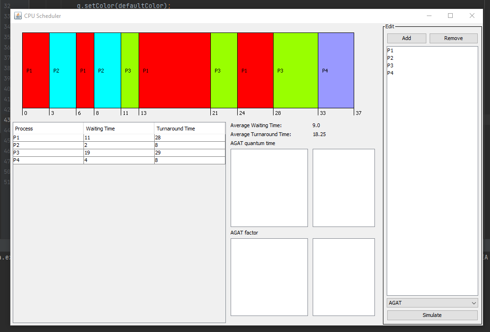
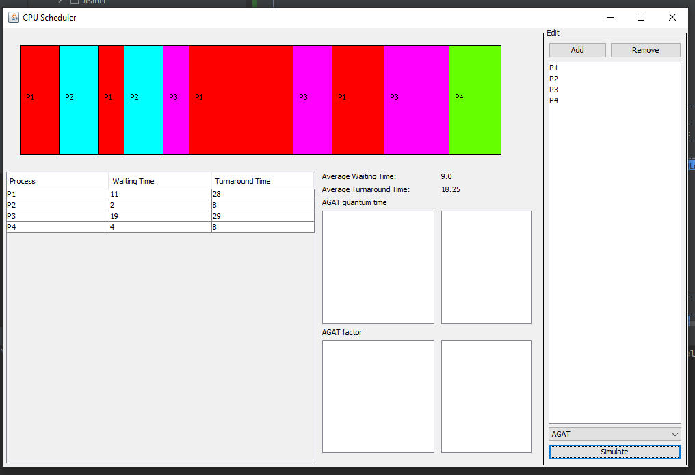

# CPUScheduling
CPU scheduling algorithms simulator and visualizer. 
Was made as an assignment for the Operating Systems course taught in Cairo University Fauclty of Computers and Artificial Inteligence.

## Features
- A graphical user intreface showing wait and turnover time of each process, 
as well as a [Gantt chart](https://en.wikipedia.org/wiki/Gantt_chart) showing the simulated processes
- Priority scheduling algorithm
- Shortest Job First (SJF) algorithm
- Shortest Remaining Time First (SRTF) algorithm
- AGAT algorithm

## Screenshots

